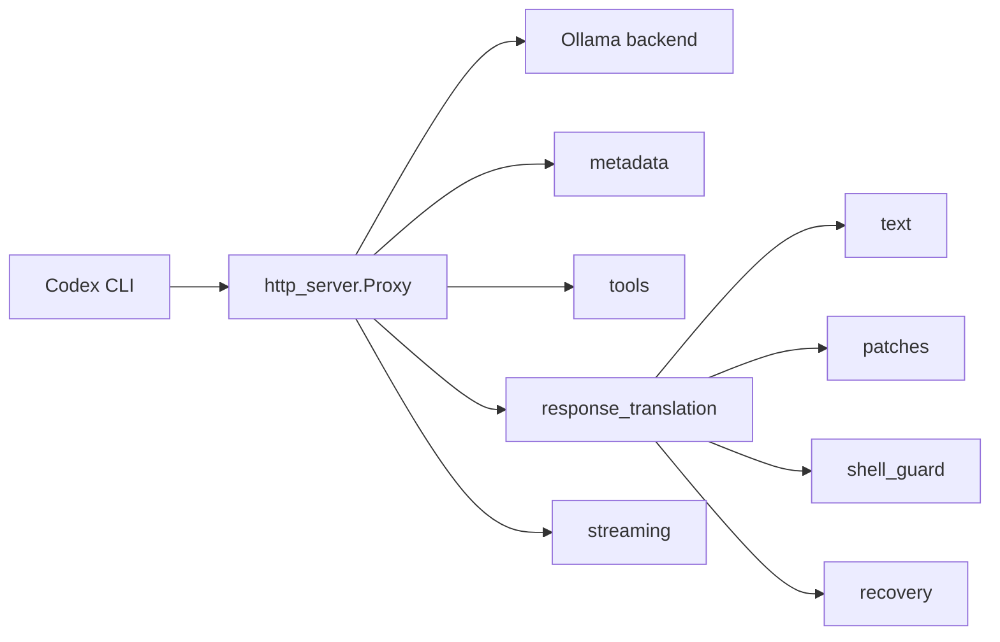
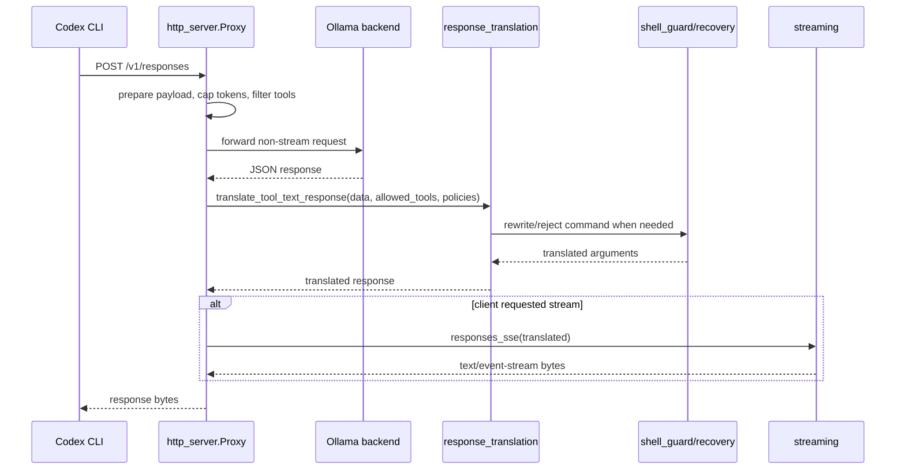

# PRD: Refactor `ollama_codex_proxy.py`

Complexity: 5 -> MEDIUM mode

## 1. Context

**Problem:** `src/ollama_codex_proxy.py` has grown to 1,331 lines and currently mixes HTTP proxying, Ollama/OpenAI response translation, patch-command compatibility, shell-write safety policy, model metadata, SSE rendering, and CLI bootstrap in one file.

**Files Analyzed:**

- `src/ollama_codex_proxy.py`
- `tests/test_proxy_parser.py`
- `README.md`
- `.env.example`
- `Makefile`

**Current Behavior:**

- `bin/llama-codex` starts `src/ollama_codex_proxy.py` as the compatibility proxy for Ollama.
- `Proxy.do_GET` serves model metadata for `/v1/models`, `/models`, and `/api/tags`, then forwards all other GET requests to the backend.
- `Proxy.do_POST` rewrites `/v1/responses` payloads to force the configured model, cap output tokens, filter tools, disable upstream streaming, and post-process model responses.
- Response post-processing normalizes model text, parses plain-text tool calls, converts `apply_patch` forms into executable `exec_command` calls, guards unsafe shell writes, enforces forced patch recovery, and synthesizes SSE events when the client requested streaming.
- `tests/test_proxy_parser.py` is also too broad: it imports the monolithic script directly and tests parsing, patch compatibility, shell guard behavior, force-patch policy, response translation, metadata, and tool filtering in one 971-line file.

## 2. Integration Points

**How will this refactor be reached?**

- [x] Entry point identified: `bin/llama-codex` continues to execute `src/ollama_codex_proxy.py`.
- [x] Caller file identified: `src/ollama_codex_proxy.py` remains the CLI/server entry point and imports the new internal modules.
- [x] Registration/wiring needed: keep `main()` and `Proxy` reachable from the original script path; no wrapper changes unless imports require a package path adjustment.

**Is this user-facing?**

- [x] NO -> Internal refactor. It is triggered by the existing `llama-codex` proxy startup path and by Codex requests to the local OpenAI-compatible proxy.

**Full user flow:**

1. User runs `llama-codex --yolo` or `llama-codex exec "..."`
2. `bin/llama-codex` starts the local proxy script.
3. Codex sends `/v1/responses` requests through `Proxy.do_POST`.
4. New modules handle payload preparation, tool filtering, response translation, and forwarding.
5. User sees the same Codex behavior: local model responses become valid tool calls, unsafe edits are rejected or rewritten, and streamed responses still arrive as SSE.

## 3. Solution

**Approach:**

- Preserve `src/ollama_codex_proxy.py` as the stable executable facade containing only CLI argument parsing, server construction, and compatibility exports needed during migration.
- Split pure logic into small modules under `src/ollama_codex_proxy/` so parser, patch compatibility, shell guard, response translation, metadata, and HTTP forwarding responsibilities can be tested independently.
- Split `tests/test_proxy_parser.py` into focused characterization suites that mirror the new modules while preserving every existing assertion before deleting the monolithic test file.
- Keep runtime behavior and public command-line flags unchanged; this PRD is a refactor, not a feature change.
- Avoid new dependencies. Use the Python standard library already used by the proxy.

**Target Module Layout:**

```text
src/
  ollama_codex_proxy.py                  # executable facade and backward-compatible imports
  ollama_codex_proxy/
    __init__.py
    cli.py                               # argparse, server configuration, main()
    http_server.py                       # Proxy handler and forwarding
    metadata.py                          # model_metadata(), cap_positive_int()
    streaming.py                         # sse_event(), responses_sse()
    tools.py                             # tool_name(), tool_denied(), parse_tool_text()
    text.py                              # normalize_model_text(), normalize_response_text()
    patches.py                           # patch parsing, repair, apply_patch compatibility
    shell_guard.py                       # shell write rewrites and exec guard policy
    response_translation.py              # translate_tool_text_response() orchestration
    recovery.py                          # force-patch and update-after-patch policy
tests/
  test_metadata.py
  test_tools.py
  test_patch_compat.py
  test_shell_guard.py
  test_response_translation.py
  test_recovery.py
  test_http_proxy.py
```

**Architecture Diagram:**



**Key Decisions:**

- [x] Keep `ollama_codex_proxy.py` executable to avoid breaking `bin/llama-codex`, direct script usage, and any external imports used by tests.
- [x] Use plain functions and small modules, not classes, for pure translation and command-rewrite logic.
- [x] Keep errors explicit by preserving existing diagnostic shell commands and response bodies byte-for-byte where tests assert on them.
- [x] Split tests after moving each responsibility so every phase has a runnable characterization suite.
- [x] Do not change `.env.example` or environment variable names; CLI defaults remain `LLAMA_CODEX_MAX_OUTPUT_TOKENS`, `LLAMA_CODEX_DENY_TOOL_PATTERN`, and `LLAMA_CODEX_REJECT_SHELL_WRITES`.

**Data Changes:** None.

## 4. Sequence Flow



## 5. Execution Phases

#### Phase 1: Establish Package Facade - Existing CLI path still starts the same proxy

**Files (max 5):**

- `src/ollama_codex_proxy.py` - convert to thin executable facade that imports and calls package `main()`
- `src/ollama_codex_proxy/__init__.py` - re-export legacy function names required by existing tests during migration
- `src/ollama_codex_proxy/cli.py` - move argparse and `ThreadingHTTPServer` startup
- `src/ollama_codex_proxy/http_server.py` - move `Proxy` class and `read_json()`
- `tests/test_http_proxy.py` - add initial smoke coverage for `Proxy` importability and facade exports

**Implementation:**

- [ ] Create the package directory without changing command-line flags.
- [ ] Move `main()` into `cli.py`; leave `if __name__ == "__main__": main()` in `ollama_codex_proxy.py`.
- [ ] Move `Proxy` and `read_json()` into `http_server.py`.
- [ ] Re-export all functions currently imported by `tests/test_proxy_parser.py` from `__init__.py` or facade module to keep migration incremental.
- [ ] Ensure `python3 src/ollama_codex_proxy.py --help` still works from the repository root.

**Tests Required:**

| Test File | Test Name | Assertion |
|-----------|-----------|-----------|
| `tests/test_http_proxy.py` | `should_import_proxy_handler_from_facade_when_script_module_loaded` | Existing script import exposes `Proxy` and `main` |
| `tests/test_http_proxy.py` | `should_show_help_when_cli_invoked` | `python3 src/ollama_codex_proxy.py --help` exits 0 and includes `--model` |
| `tests/test_proxy_parser.py` | existing tests | All legacy tests still pass during migration |

**Verification Plan:**

- `python3 -m py_compile src/ollama_codex_proxy.py src/ollama_codex_proxy/*.py`
- `python3 tests/test_proxy_parser.py`
- `python3 tests/test_http_proxy.py`
- `make test`

**User Verification:**

- Action: Run `./bin/llama-codex --llama-status`.
- Expected: Status command still reaches the local proxy management path without import errors.

#### Phase 2: Extract Metadata, Tool Parsing, Text Normalization, and Streaming - Pure helpers are isolated

**Files (max 5):**

- `src/ollama_codex_proxy/metadata.py` - move `model_metadata()` and `cap_positive_int()`
- `src/ollama_codex_proxy/tools.py` - move `tool_name()`, `tool_denied()`, and `parse_tool_text()`
- `src/ollama_codex_proxy/text.py` - move `normalize_model_text()` and `normalize_response_text()`
- `src/ollama_codex_proxy/streaming.py` - move `sse_event()` and `responses_sse()`
- `tests/test_tools.py` - move parser, metadata, text normalization, tool filtering, and SSE helper tests

**Implementation:**

- [ ] Move pure helpers with no behavior changes.
- [ ] Update `http_server.py` imports for metadata, tool filtering, text normalization, and SSE generation.
- [ ] Keep compatibility re-exports in `ollama_codex_proxy.py` until the legacy test file is removed.
- [ ] Move relevant assertions out of `tests/test_proxy_parser.py`.
- [ ] Remove duplicate test coverage from `test_proxy_parser.py` only after the new tests pass.

**Tests Required:**

| Test File | Test Name | Assertion |
|-----------|-----------|-----------|
| `tests/test_tools.py` | `should_parse_qwen_tool_call_suffix_when_allowed` | Plain JSON before `</tool_call>` becomes `(name, arguments)` |
| `tests/test_tools.py` | `should_ignore_disallowed_tool_name` | Disallowed tool returns `None` |
| `tests/test_tools.py` | `should_parse_xml_function_attribute_tool_call` | XML-style call is decoded and parsed |
| `tests/test_tools.py` | `should_normalize_channel_markup_in_response_text` | Channel markers are removed from output text |
| `tests/test_tools.py` | `should_report_model_context_window` | `model_metadata()` includes configured context window |
| `tests/test_tools.py` | `should_cap_positive_int_to_limit` | Invalid or excessive values clamp to cap |
| `tests/test_tools.py` | `should_match_denied_tool_by_short_or_full_name` | Pattern matches `functions.name` and `name` |
| `tests/test_tools.py` | `should_render_response_as_sse_events` | SSE output includes created, output item, and completed events |

**Verification Plan:**

- `python3 tests/test_tools.py`
- `python3 tests/test_proxy_parser.py`
- `make test`

**User Verification:**

- Action: Start the proxy and GET `/api/tags`.
- Expected: Response still reports `model`, `context_window`, `max_output_tokens`, `deny_tool_pattern`, and `reject_shell_writes`.

#### Phase 3: Extract Patch Compatibility - Apply-patch translation becomes independently testable

**Files (max 5):**

- `src/ollama_codex_proxy/patches.py` - move patch delimiter, patch parsing, repair, extraction, and compatibility command helpers
- `src/ollama_codex_proxy/response_translation.py` - update imports for apply-patch translation entry points
- `src/ollama_codex_proxy/shell_guard.py` - update imports for conditional apply-patch command helpers
- `tests/test_patch_compat.py` - move apply-patch compatibility and malformed patch tests
- `tests/test_response_translation.py` - add/update tests for native apply-patch object translation

**Implementation:**

- [ ] Move `patch_delimiter()`, `patch_file_line()`, `add_file_patch()`, `replace_file_patch()`, `apply_patch_command()`, `shorthand_patch_command()`, `apply_patch_compat_command()`, `is_patch_text()`, patch repair functions, unified diff extraction, and native apply-patch translation helpers.
- [ ] Keep `conditional_apply_patch_command()` in `patches.py` because both shell guard and patch compatibility use it.
- [ ] Preserve generated shell command text exactly where existing tests assert substrings such as `llama-codex apply_patch compatibility`, `git apply --recount`, and `PY_LLAMACODEX_DIFF`.
- [ ] Move the patch-specific tests from the legacy test file into `test_patch_compat.py`.
- [ ] Keep response-level apply-patch object tests in `test_response_translation.py` because they assert orchestration, not patch parsing alone.

**Tests Required:**

| Test File | Test Name | Assertion |
|-----------|-----------|-----------|
| `tests/test_patch_compat.py` | `should_repair_unprefixed_add_file_lines` | Missing `+` prefixes are repaired under `*** Add File:` |
| `tests/test_patch_compat.py` | `should_convert_unified_add_file_diff_to_conditional_apply_patch` | `/dev/null` unified add creates conditional add/replace command |
| `tests/test_patch_compat.py` | `should_repair_wrapped_unified_diff_headers` | `-- path` and `++ path` become valid diff headers |
| `tests/test_patch_compat.py` | `should_reject_shorthand_patch_that_shadows_package` | Top-level `notes.py` is guarded when `notes/` exists |
| `tests/test_response_translation.py` | `should_translate_native_apply_patch_call_to_exec_command` | Function call named `apply_patch` becomes `exec_command` |
| `tests/test_response_translation.py` | `should_translate_nested_apply_patch_object` | Nested tool call object is rewritten in place |

**Verification Plan:**

- `python3 tests/test_patch_compat.py`
- `python3 tests/test_response_translation.py`
- `python3 tests/test_proxy_parser.py`
- `make test`

**User Verification:**

- Action: Send a model response containing an embedded `*** Begin Patch` block through `/v1/responses`.
- Expected: Proxy returns an `exec_command` call whose command executes the compatibility patch wrapper.

#### Phase 4: Extract Shell Guard and Recovery Policies - Edit safety rules are isolated

**Files (max 5):**

- `src/ollama_codex_proxy/shell_guard.py` - move command rewrite and forbidden edit detection
- `src/ollama_codex_proxy/recovery.py` - move force-patch-first and require-update-after-patch policies
- `src/ollama_codex_proxy/response_translation.py` - call the extracted policy modules
- `tests/test_shell_guard.py` - move shell-write guard tests
- `tests/test_recovery.py` - move forced patch recovery tests

**Implementation:**

- [ ] Move `rewrite_cat_heredoc()`, `rewrite_touch()`, `rewrite_echo_redirect()`, `rewrite_apply_patch_shell_command()`, `rewrite_shell_write_command()`, `extract_nested_exec_arguments()`, and `apply_exec_guard()`.
- [ ] Move `force_patch_first_command()`, `patch_first_is_satisfied()`, `require_update_patch_after_prior_patch()`, `force_patch_first_missing_tool_command()`, `payload_requests_force_patch_first()`, `payload_contains_successful_patch_output()`, and `premature_prose_command()`.
- [ ] Keep policy messages byte-for-byte compatible unless a test intentionally documents an improved diagnostic.
- [ ] Split all shell guard and recovery tests out of `tests/test_proxy_parser.py`.
- [ ] Add at least one negative test per module proving non-target commands pass through unchanged.

**Tests Required:**

| Test File | Test Name | Assertion |
|-----------|-----------|-----------|
| `tests/test_shell_guard.py` | `should_rewrite_touch_to_apply_patch_when_shell_writes_rejected` | `touch` becomes conditional apply_patch command |
| `tests/test_shell_guard.py` | `should_rewrite_cat_heredoc_to_apply_patch` | heredoc file writes become add/replace patch commands |
| `tests/test_shell_guard.py` | `should_reject_rm_source_edit_command` | destructive edit command becomes diagnostic command |
| `tests/test_shell_guard.py` | `should_unwrap_nested_exec_command_then_apply_guard` | nested `exec_command(...)` arguments are extracted and guarded |
| `tests/test_recovery.py` | `should_detect_force_patch_first_prompt` | recovery trigger text is recognized in nested payloads |
| `tests/test_recovery.py` | `should_reject_diagnostic_command_during_force_patch_first` | first non-patch command becomes diagnostic |
| `tests/test_recovery.py` | `should_require_update_patch_after_prior_patch_output` | full rewrite patch is rejected after successful patch output |
| `tests/test_recovery.py` | `should_allow_update_patch_after_prior_patch_output` | targeted update patch passes through |

**Verification Plan:**

- `python3 tests/test_shell_guard.py`
- `python3 tests/test_recovery.py`
- `python3 tests/test_response_translation.py`
- `python3 tests/test_proxy_parser.py`
- `make test`

**User Verification:**

- Action: Send a response with an unsafe `rm bookmarks/vault.py` tool call while `reject_shell_writes` is enabled.
- Expected: Proxy returns an `exec_command` diagnostic that rejects the edit and includes the original command.

#### Phase 5: Finalize Response Translation and Remove Legacy Test File - Responsibilities are fully separated

**Files (max 5):**

- `src/ollama_codex_proxy/response_translation.py` - own `translate_tool_text_response()` and orchestration helpers
- `src/ollama_codex_proxy/http_server.py` - depend only on public module functions, not facade re-exports
- `src/ollama_codex_proxy.py` - remove temporary compatibility re-exports not needed by runtime
- `tests/test_response_translation.py` - contain all response orchestration tests
- `tests/test_proxy_parser.py` - delete after all tests are migrated

**Implementation:**

- [ ] Move `translate_tool_text_response()` completely into `response_translation.py`.
- [ ] Ensure `http_server.Proxy.forward()` calls the new translator directly.
- [ ] Remove compatibility exports from the facade except `main` and any deliberately public symbols.
- [ ] Delete `tests/test_proxy_parser.py` after every existing test has a home in focused test files.
- [ ] Update `Makefile` so `make test` compiles package modules and runs all `tests/test_*.py` scripts deterministically.

**Tests Required:**

| Test File | Test Name | Assertion |
|-----------|-----------|-----------|
| `tests/test_response_translation.py` | `should_translate_text_tool_call_message_to_function_call` | Plain text tool JSON becomes completed function call |
| `tests/test_response_translation.py` | `should_translate_embedded_patch_text_to_exec_command` | Embedded patch prose becomes `exec_command` |
| `tests/test_response_translation.py` | `should_translate_embedded_unified_diff_text_to_exec_command` | Embedded unified diff becomes compatibility command |
| `tests/test_response_translation.py` | `should_reject_premature_prose_only_response` | Intent-to-fix prose becomes diagnostic command |
| `tests/test_response_translation.py` | `should_not_reject_completion_prose` | Completion prose remains a message |
| `tests/test_http_proxy.py` | `should_prepare_responses_payload_without_streaming_upstream` | `/v1/responses` forwarding sets configured model and disables upstream streaming |

**Verification Plan:**

- `python3 -m py_compile src/ollama_codex_proxy.py src/ollama_codex_proxy/*.py`
- `for test_file in tests/test_*.py; do python3 "$test_file"; done`
- `make test`

**User Verification:**

- Action: Run `make test`.
- Expected: All focused tests pass, the old monolithic parser test is gone, and the proxy script still compiles.

## 6. Checkpoint Protocol

After each phase:

- Run the phase-specific commands listed in the Verification Plan.
- Run `make test`.
- Review `git diff --stat` and confirm the phase changed no more than the listed files, except mechanical updates to `Makefile` in Phase 5.
- Compare migrated tests against the original `tests/test_proxy_parser.py` before deleting any test to confirm no assertion was lost.

Automated checkpoint instruction from the PRD skill:

```text
Use Task tool with:
- subagent_type: "prd-work-reviewer"
- prompt: "Review checkpoint for phase [N] of PRD at docs/PRDs/ollama-codex-proxy-refactor.md"
```

If no `prd-work-reviewer` agent is available in the execution environment, use this fallback checkpoint:

- `git diff --check`
- `python3 -m py_compile src/ollama_codex_proxy.py src/ollama_codex_proxy/*.py`
- `for test_file in tests/test_*.py; do python3 "$test_file"; done`
- `make test`

## 7. Verification Strategy

**Unit Tests:**

- Pure modules (`metadata.py`, `tools.py`, `text.py`, `streaming.py`, `patches.py`, `shell_guard.py`, `recovery.py`) are tested directly with focused Python scripts.
- Every test currently in `tests/test_proxy_parser.py` must be migrated or intentionally removed with a documented reason in the implementing PR.

**Integration Tests:**

- `tests/test_response_translation.py` verifies that parser, patch compatibility, shell guard, and recovery modules work together against OpenAI Responses-style payloads.
- `tests/test_http_proxy.py` covers request preparation and response forwarding behavior with a fake backend or mocked `urlopen`.

**API Proof:**

```bash
python3 src/ollama_codex_proxy.py \
  --host 127.0.0.1 \
  --port 11435 \
  --backend http://127.0.0.1:11434 \
  --model qwen3-coder-30b-65k
```

```bash
curl -s http://127.0.0.1:11435/api/tags | python3 -m json.tool
```

Expected: JSON includes the configured model, context window, max output tokens, deny-tool pattern, and shell-write guard setting.

**Regression Command:**

```bash
make test
```

Expected: compiles proxy modules, runs every test script, and validates shell scripts.

## 8. Acceptance Criteria

- [ ] `src/ollama_codex_proxy.py` is under 120 lines and acts only as executable facade plus any intentional compatibility exports.
- [ ] No extracted module exceeds 350 lines.
- [ ] `tests/test_proxy_parser.py` is removed or reduced to a temporary import-compatibility shim with no unique assertions.
- [ ] All tests previously present in `tests/test_proxy_parser.py` are migrated into focused test files.
- [ ] `make test` passes.
- [ ] `python3 src/ollama_codex_proxy.py --help` passes.
- [ ] `bin/llama-codex` does not require changes to locate or start the proxy.
- [ ] CLI flags and environment variables remain backward compatible.
- [ ] Diagnostic messages for rejected shell writes, malformed patches, forced patch recovery, and premature prose remain covered by tests.
- [ ] Streaming clients still receive `text/event-stream` output when requesting `stream: true`.

## 9. Risks and Mitigations

- **Risk:** Import path conflicts between `src/ollama_codex_proxy.py` and package directory `src/ollama_codex_proxy/`.
  **Mitigation:** In Phase 1, verify direct script execution and import-by-path tests before moving deeper logic. If Python resolves the script module in a way that blocks package imports, rename the package to `ollama_codex_proxy_lib` and document the deviation in the implementing PR.

- **Risk:** Tests lose coverage while being split.
  **Mitigation:** Move tests in small groups, keep the legacy file passing until the final phase, and compare `rg "^def test_"` counts before deletion.

- **Risk:** Byte-sensitive shell command diagnostics drift.
  **Mitigation:** Preserve existing substring assertions and add focused tests for policy messages before moving implementation.

- **Risk:** HTTP behavior regresses because pure helper tests do not exercise forwarding.
  **Mitigation:** Add `test_http_proxy.py` with mocked backend responses for `/v1/responses`, `/api/tags`, and stream conversion.

- **Risk:** Refactor grows into behavior redesign.
  **Mitigation:** Treat any changed diagnostic, flag, environment variable, response schema, or command shape as out of scope unless a failing characterization test proves the current behavior is broken.
